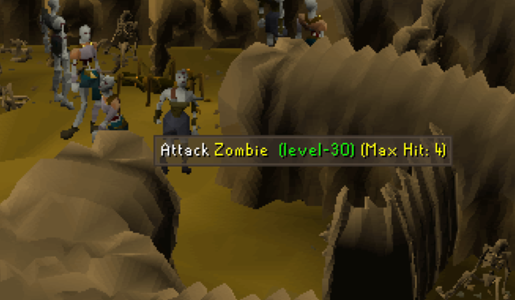
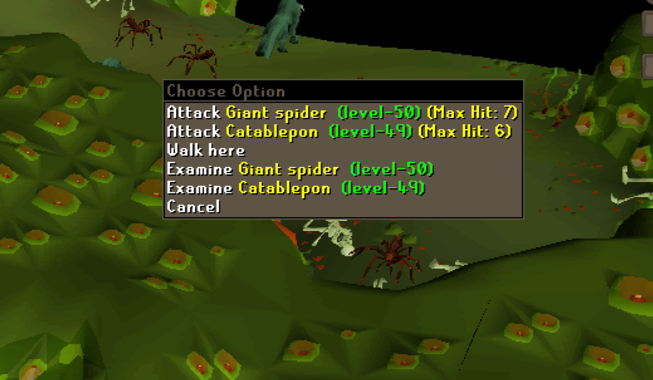

 

  
  <h2>NPC Max Hit</h2>

---

A RuneLite plugin that displays the **maximum hit values for NPCs**, using data sourced from
the OSRS Wiki.

---

## Features

- **Overlay**:
    - Displays maximum hit values for NPCs in a customizable overlay.
    - Shows all max hits per combat style (if multiple styles exist).
    - Includes a **Compact Mode** to display only the highest value with simplified NPC names.
    - Toggleable.

- **Infobox**:
    - Provides a simplified max hit display in an infobox.
    - Detailed information is available on hover.
    - Toggleable.

- **Menu Options**:
    - Adds max hit values to the right-click menu and on hover.
    - Configurable to show on "**Attack**" and/or "**Examine**" options.
    - Supports two styles: **Label + Value** or **Number Only**.
    - Toggleable.

- **Lookup on Examine**:
    - Displays max hit values when examining NPCs.

- **Filtering**:
    - Allows filtering of specific NPCs by ID or below a set combat level.

---

## Screenshots

|                Overlay                |                Infobox                |
|:-------------------------------------:|:-------------------------------------:|
|  |  |
|  |  |

|          Menu Options           |           Different Variants            |
|:-------------------------------:|:---------------------------------------:|
|  |  |
|  |  |

---

---

## Notes

- Max hit values do not factor in protection prayers or damage reduction.
- Data is pulled from the OSRS Wiki and may be outdated.
- Always verify critical values in-game or on the wiki if unsure.

---

## Issues

If you have any feedback, suggestions, or issues,
please [open an issue](https://github.com/hirzalla/npc-max-hit/issues).

I can also be reached @`learth` on Discord.

---

## Data Attribution

Data provided by the [Old School RuneScape Wiki](https://oldschool.runescape.wiki/).

