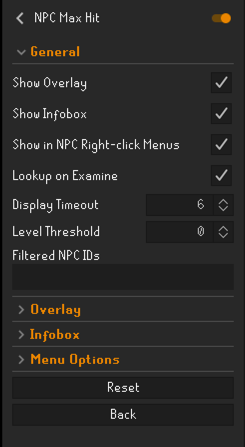

# NPC Max Hit

---
A RuneLite plugin that displays the max hit values for NPCs you are currently fighting, sourced from the OSRS Wiki.

---

## Screenshots

| Feature                  | Screenshot 1                                            | Screenshot 2                                            |
|--------------------------|---------------------------------------------------------|---------------------------------------------------------|
| Multiple Variants/Phases |  |  |
| Overlay                  |          |          |
| Infobox                  |          |          |

## Features

- Shows max hit values for your current opponent (NPCs, bosses, etc.)
- Fetches data directly from the OSRS Wiki
- Supports multiple monster variants/phases (e.g. Zulrah, Phantom Muspah)
- Display options:
    - Overlay with all max hit information (e.g. melee, ranged, magic, specials)
        - Compact mode to only display the highest max hit and simplified NPC name
    - Infobox showing highest max hit with a detailed tooltip on hover
- Auto-hides after combat inactivity
- Filtering options:
    - Combat level threshold to hide max hits for low-level NPCs
    - Specific NPC IDs to exclude from display

---

## Configurations

---

## Notes

The max hit values displayed:

- Don't account for protection prayers or other damage reduction effects
- Are parsed from OSRS Wiki and may not always be accurate
- May be outdated if the Wiki hasn't been updated after game updates

Please verify critical information directly on the Wiki.

---

## Attribution

Data is sourced from the [Old School RuneScape Wiki](https://oldschool.runescape.wiki/).

